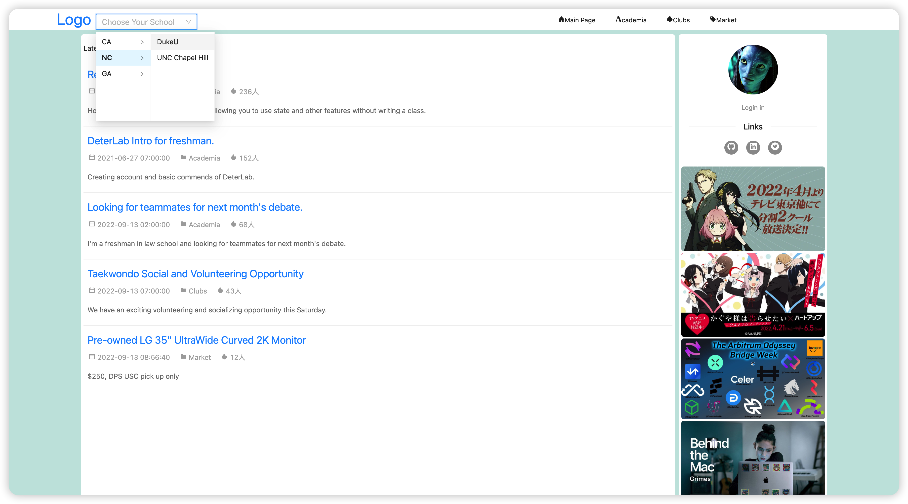
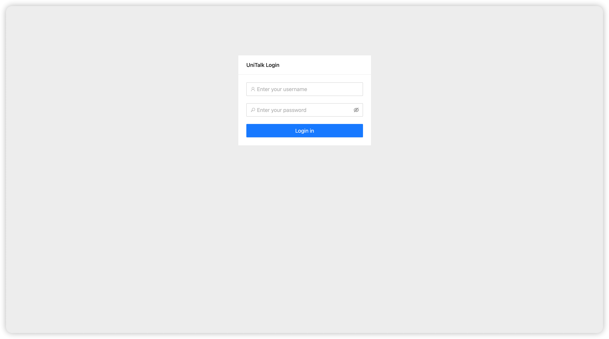
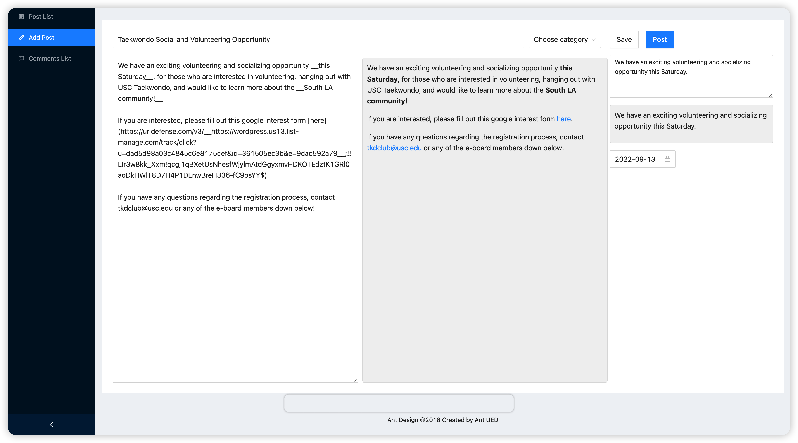

# React-University-Forum

This is an online forum created for university students to post articles and exchange ideas regarding academic study, student club affairs, and second-hand products dealings. 
This website is created by Fantao Meng and Shiyang Pan

## About Website Details

### Login Authentication
Users should first login with their user name and password if they have already been added into the databases. Otherwise, they are not allowed to login and see the contents in the forum. 

### Main page and article detail page
In this forum, users can read all the articles posted by themselves and other users. To post articles, users should write in Markdown format, and the website will automatically render the content and display the details. Users can also post their comments under the articles. 

### Self posts manangement page
Users can post new articles, edit and deleted old posts in the self posts manangement page. Users can also read and manage their previously posted comments.
  
